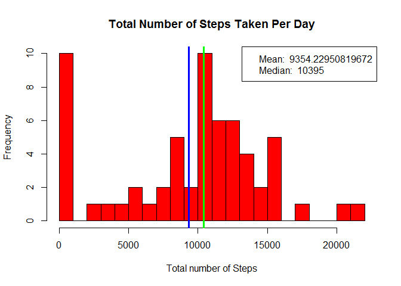
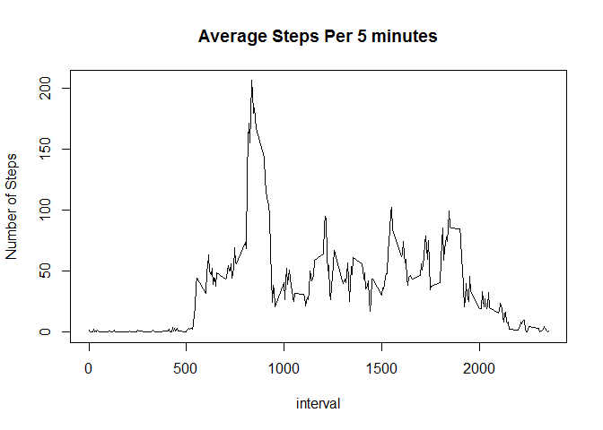
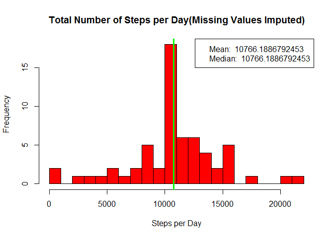
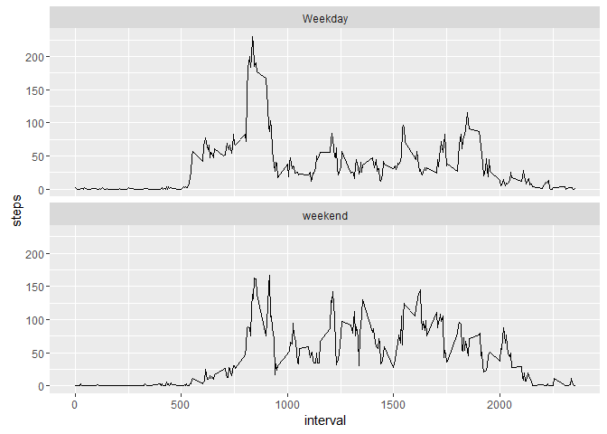

# Reproducible Research: Peer Assessment 1


## Loading and preprocessing the data
---
We should load the data into the workspace as:

```r
data <- read.csv("activity.csv", header = TRUE)
names(data)
```

```
## [1] "steps"    "date"     "interval"
```


## What is mean total number of steps taken per day?
---
The following code creates the histogram of the mean total number of steps taken per day.

```r
data.date <- aggregate(data[1], FUN = sum, na.rm = T, by = data[2])

step_data<- data.date$steps

## plot the histogram
hist(step_data, breaks = 20, col = "red",
     xlab = "Total number of Steps",
     main = "Total Number of Steps Taken Per Day")

## calculate mean and median
sMean <- mean(step_data)
abline(v = sMean, lwd = 3, col = "blue")
sMedian <- median(step_data)
abline(v = sMedian, lwd = 3, col = "green")

## legend
legend('topright', col = c("blue", "green"),
    legend = c(paste('Mean: ', sMean), paste('Median: ', sMedian)))
```




## What is the average daily activity pattern?
---
The following code snippet cretes the time-series plot for the daily activity pattern.

```r
data.interval <- aggregate(data[1], FUN = mean, na.rm = T, by = data[3])

plot(x = data.interval$interval, type = "l", y = data.interval$steps, main = "Average Steps Per 5 minutes", xlab = "interval", ylab = "Number of Steps")
```


# Interval having Maximum Average Steps


```r
iMax <- data.interval[data.interval$steps == max(data.interval$steps), ]
## get max interval
iMax[1]
```

```
##     interval
## 104      835
```

```r
## get max steps per interval
round(iMax[2], 1)
```

```
##     steps
## 104 206.2
```

The maximum average steps per second occur a 835, with an average 206.2 steps per 5 minutes.


## Imputing missing values
---
1. **Calculate the number of missing values**

```r
nrow(data)
```

```
## [1] 17568
```

```r
sum(is.na(data$steps))
```

```
## [1] 2304
```
* **Total number of Rows: ** 17,568
* **Total number of Rows with missing values: ** 2,304

2. **Rplacing Missing values**
We will replace the missing value with the mean for that interval.

3. **Creating new datasets with missing values replaced**
Following code creates the new dataset without the missing values.

```r
library(plyr)
```

```
## Warning: package 'plyr' was built under R version 3.2.4
```

```r
impute.mean <- function(x) replace(x, is.na(x), mean(x, na.rm = T))
data.impute <- ddply(data, ~interval, transform, steps = impute.mean(steps))
```

4. **Histogram**
Histogram for the new dataset as shown below.

```r
data.impute.date <- aggregate(data.impute[1], FUN = sum, na.rm = T, by = data.impute[2])

hist(data.impute.date$steps, breaks = 20, col = "red",
     main = "Total Number of Steps per Day(Missing Values Imputed)", 
     xlab = "Steps per Day")

## calculate mean and median
iMean <- mean(data.impute.date$steps)
abline(v = iMean, lwd = 3, col = "blue")
iMedian <- median(data.impute.date$steps)
abline(v = iMedian, lwd = 3, col = "green")

## legend
legend('topright', col = c("blue", "green"),
    legend = c(paste('Mean: ', iMean), paste('Median: ', iMedian)))
```




## Are there differences in activity patterns between weekdays and weekends?
1. **Create a new Factor variable with two levels - "weekday" and "weekend"**

```r
data.impute$dateP <- as.POSIXlt(data.impute$date, format = "%Y-%m-%d")
data.impute$day <- "Weekday"
data.impute$day[weekdays(data.impute$dateP) %in% c("Saturday", "Sunday")] <- "weekend"
```

2. **Time Series Plot**

```r
data.impute.interval <- aggregate(data.impute[1], FUN = mean, na.rm = T, by = data.impute[c(3, 5)])

library(ggplot2)
```

```
## Warning: package 'ggplot2' was built under R version 3.2.4
```

```r
plot <- ggplot(data = data.impute.interval, aes(x = interval, y = steps))

plot + geom_line() + facet_wrap(~day, nrow = 2)
```


